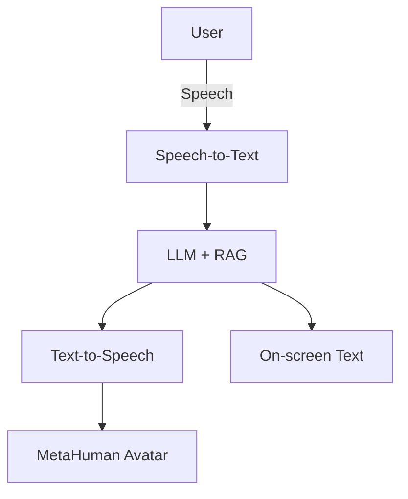
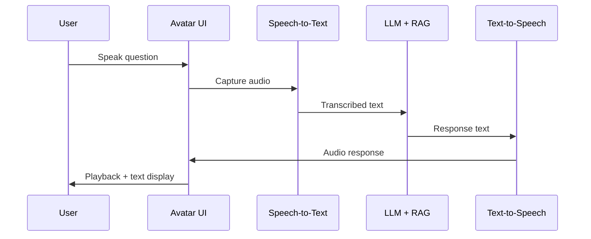

# Diagrams

## System Overview

```mermaid
graph TD
  User -->|Speech| STT[Speech-to-Text]
  STT --> LLM[LLM + RAG]
  LLM --> TTS[Text-to-Speech]
  TTS --> Avatar[MetaHuman Avatar]
  LLM --> UI[On-screen Text]
```

## Interaction Flow

```mermaid
sequenceDiagram
  participant U as User
  participant A as Avatar UI
  participant STT as Speech-to-Text
  participant LLM as LLM + RAG
  participant TTS as Text-to-Speech

  U->>A: Speak question
  A->>STT: Capture audio
  STT->>LLM: Transcribed text
  LLM->>TTS: Response text
  TTS->>A: Audio response
  A->>U: Playback + text display
```
